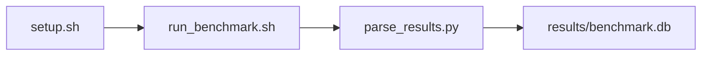

# ResNet-50 FP16 Training Step (PyTorch) Benchmark

[](LICENSE)
[](.github/workflows/ci.yml)

Target: Ubuntu 26.04 · NVIDIA · see Hardware Requirements. This is a host benchmark, not a laptop `pip install` project.

## Quick Start

```bash
git clone https://github.com/garys-gpu-benchmarks/421-gpu-bench-nvidia-resnet50-pytorch-training-ubu2604.git
cd 421-gpu-bench-nvidia-resnet50-pytorch-training-ubu2604
sudo bash setup.sh --assume-yes
bash run_benchmark.sh --profile smoke --validate
```
Results are written to `results/benchmark.db` and `results/summary.json`.

This workload is executed on the validation host after the repository is copied there. `setup.sh` and `run_benchmark.sh` do not open an outbound SSH session.

Prerequisites: Ubuntu 26.04; NVIDIA; Python 3.14.4; root or sudo for `setup.sh`. Framework: Bash, SQLite, Python, PyYAML, CUDA Runtime, PyTorch-CUDA, torchvision, ResNet-50. This is a host benchmark, not a laptop `pip install` project.



## 1. Overview

Runs scripts/train_resnet50.py (synthetic images, FP16 AMP) twice via collect_resnet50_train.py. dataset_name: synthetic. precision: fp16. image_size, batch_size, warmup_iters, and num_iterations come from yaml. Sweep dimensions: dataset_name, precision, image_size, batch_size, num_workers, optimizer, learning_rate, gradient_accumulation.

## 2. What It Validates

- Validates two timed training passes plus a summary average on synthetic FP16 ResNet-50 steps
- #1: Training batch step time (step_time_msec); is present and physically sensible.
- #2: Training throughput (images_per_sec); is present and physically sensible.
- #3: Achieved compute throughput (fp16_tflops); is present and physically sensible.
- #4: Peak GPU memory (peak_gpu_memory_gb); is present and physically sensible.
- #5: Modeled weight and feature-map traffic, GB/s (modeled_weight_feature_traffic_gb_s) is present and physically sensible.

## 3. Metrics Captured

- **#1: Training batch step time** — stored as `step_time_msec`.
- **#2: Training throughput** — stored as `images_per_sec`.
- **#3: Achieved compute throughput** — stored as `fp16_tflops`.
- **#4: Peak GPU memory** — stored as `peak_gpu_memory_gb`.
- **#5: Modeled weight and feature-map traffic, GB/s** — stored as `modeled_weight_feature_traffic_gb_s`.

## 4. Hardware Requirements

### Supported environment

- OS: Ubuntu 26.04
- GPU vendor: NVIDIA
- Framework family: Bash, SQLite, Python, PyYAML, CUDA Runtime, PyTorch-CUDA, torchvision, ResNet-50
- Python: Python 3.14.4

### Reference validation environment

The tables below describe the machine used to generate the reference results. They are not a requirement that every user buy that exact cloud instance.

### System

Runs scripts/train_resnet50.py (synthetic images, FP16 AMP) twice via collect_resnet50_train.py. dataset_name: synthetic. precision: fp16.

### GPU

Ubuntu 26.04 / NVIDIA / Bash, SQLite, Python, PyYAML, CUDA Runtime, PyTorch-CUDA, torchvision, ResNet-50

## 5. Software Requirements

| Component | Version |
|---|---|
| OS | Ubuntu 26.04 |
| Kernel | kernel 7.0.0 |
| Python | Python 3.14.4 |
| ROCm | CUDA 13.3 |
| rocBLAS | cuBLAS (bundled with CUDA 13.3) |

Runs scripts/train_resnet50.py (synthetic images, FP16 AMP) twice via collect_resnet50_train.py. dataset_name: synthetic. precision: fp16.

## 6. Installation

```bash
Run scripts/train_resnet50.py via collect_resnet50_train.py
```

## 7. Running the Benchmark

```bash
Run scripts/train_resnet50.py via collect_resnet50_train.py
```

**Validating results separately:**

```bash
export BENCHMARK_PYTHON=/usr/bin/python3.13  # optional
python3 -m venv .venv
source ".venv/bin/activate"
".venv/bin/python" scripts/validate_results.py
```

## 8. Output

### `results/benchmark.db` (SQLite)

raw_results.csv with pass1, pass2, and summary from two runs of train_resnet50.py

check,image_size,batch_size,precision,status,step_time_msec,images_per_sec,fp16_tflops,modeled_weight_feature_traffic_gb_s,peak_gpu_memory_gb
pass1,224,32,fp16,ok,80,400,12,50,6

```bash
Run scripts/train_resnet50.py via collect_resnet50_train.py
```

### `results/summary.json`

Consolidated metrics from the most recent run — suitable for CI artifact upload or dashboard ingestion.

### `results/raw/<timestamp>.txt`

raw_results.csv with pass1, pass2, and summary from two runs of train_resnet50.py

check,image_size,batch_size,precision,status,step_time_msec,images_per_sec,fp16_tflops,modeled_weight_feature_traffic_gb_s,peak_gpu_memory_gb
pass1,224,32,fp16,ok,80,400,12,50,6

## 9. Baselines / Thresholds

Expected ranges and gates live in `config/benchmark_config.yaml` under `baselines:` or `thresholds:`. To update them, edit that file — never edit validation code directly.

## 10. Troubleshooting

**`setup.sh` missing collector**
Create cannot finish without `scripts/collect_workload.py`.

**`self_check` overlay rewritten**
Do not overwrite files listed in `results/overlay_lock.json`.

**Remote SSH drop during setup**
Reconnect and resume `bash setup.sh --assume-yes`. Do not wipe `.venv` or `.cache`.

## 11. NVIDIA H100 Coding Differences

Native NVIDIA CUDA workload. Execute on the stated Ubuntu release with the host NVIDIA driver and CUDA userspace. ROCm porting notes do not apply.

## Repository layout

```text
.
├── setup.sh
├── run_benchmark.sh
├── benchmark_specification.json
├── config/
├── scripts/
├── src/
├── tests/
├── docs/
├── results/
└── LICENSE
```
